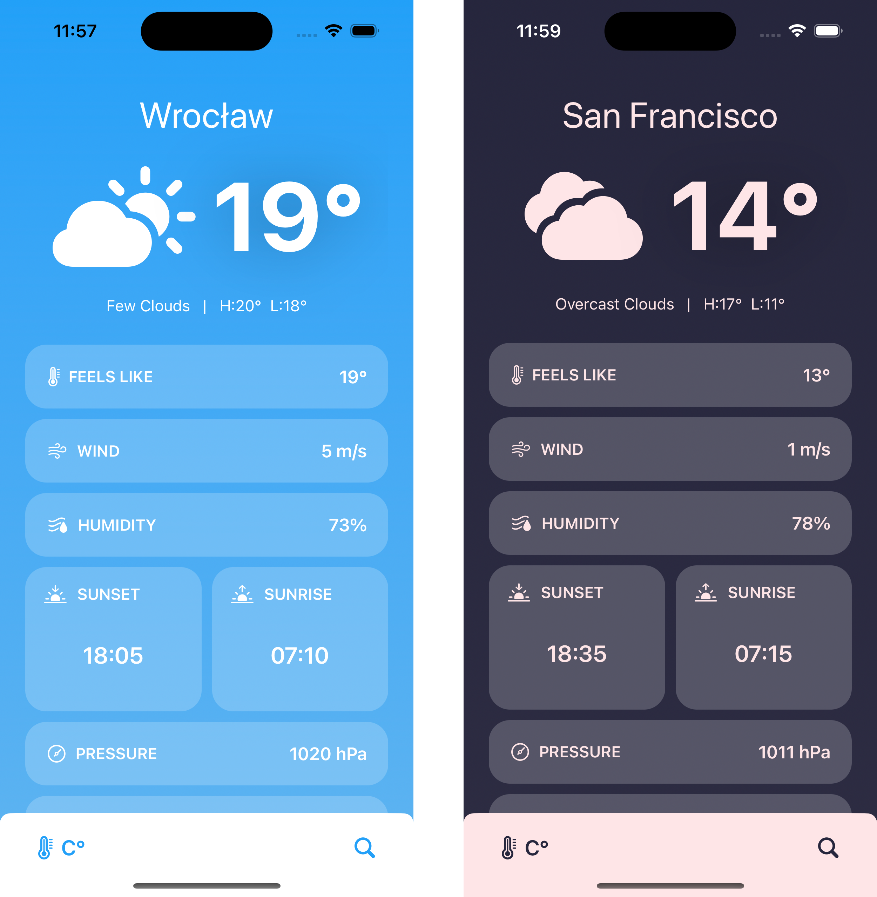

# WeatherApp README

## Table of Contents

- [Setup](#setup)
- [Overview](#overview)
- [Architecture](#architecture)
- [Design Decisions](#design-decisions)
- [Trade-offs](#trade-offs)
- [Features](#features)

## Setup

Before you start using the WeatherApp, please make sure to follow these setup steps:

1. **Obtain an API Key**: To fetch weather data, the WeatherApp relies on an external weather service API - Openweathermap.org. You need to obtain an API key from the service provider. Once you have the API key, proceed to the next steps.

2. **Clone or download** the project to your local machine.

3. **API Key Configuration**:
   - Open the `APISecrets.swift` file in the WeatherApp project.
   - Locate the `apiKey` variable and replace the placeholder with your API key.

```swift
struct APISecrets {
    static let apiKey: String = "YOUR_API_KEY_HERE"
}
```

4. **Compile and run** the app in your simulator.

## Overview

The WeatherApp is a user-friendly weather application that allows users to access real-time weather data for their location or any other location of their choice. The app seamlessly integrates with a weather API, handles network issues, and offers support for multiple temperature units.

## Architecture

The WeatherApp is built using SwiftUI for the user interface and follows the MVVM architecture pattern. Here's a brief overview of the application's components:

- **Views**: SwiftUI views that define the user interface and layout.
- **ViewModels**: ObservableObject classes that manage the application's state and business logic.
- **Services**: Classes responsible for data retrieval and handling network requests.
- **HTTPClient**: An abstraction for making HTTP requests.
- **LocationService**: Provides location-related functionality using CoreLocation.
- **Models**: Data models for weather, locations, and other related entities.

## Design Decisions

### MVVM Architecture

I chose the MVVM architecture to separate concerns and make the application more maintainable and testable. Views are responsible for rendering, ViewModels handle business logic and state, and Services manage data retrieval.

### Dependency Injection

I use dependency injection to provide services and data sources to the ViewModels. This allows to replace implementations with mock services for testing.

### Network Requests

The application makes use of URLSession for network requests. I chose this approach for its simplicity and robustness in handling network operations. And also to avoid using third-party libraries.

### Location Services

I use CoreLocation to retrieve the user's current location.

## Trade-offs

While developing the WeatherApp, I had to make some trade-offs:

- **Offline Data**: The application relies on online data, and it does not provide offline access to weather information. This trade-off was made to meet the application requirements.

- **Testing**: While I aim for comprehensive test coverage, I may not cover every corner case because my goal was to show the ability to work with tests, to demonstrate various testing techniques, for example, for testing asynchronous operations. However, tests ensure that core functionalities work correctly.

- **Design Simplicity**: The application's design is minimalistic, with room for future enhancements. I prioritized functionality over elaborate design elements.

## Features
The app consists of exactly two screens to meet users weather information needs:

**Home Screen:**  This screen displays the temperature for either users current location or a location of their choice. By default, it shows the temperature for user current location and other essential weather data.

**Search Screen:** On this screen, user can search for any location. Once user select a location, the home screen updates to display the temperature for that specific place. 

**Bonus Features:** The app supports dark/light modes and offers support for multiple temperature units.


